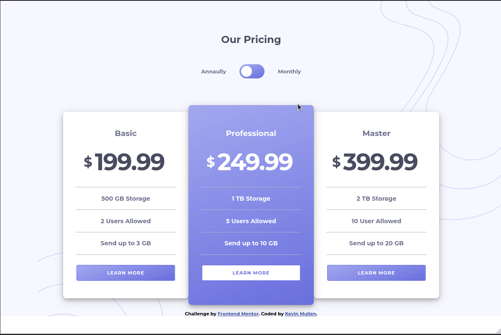
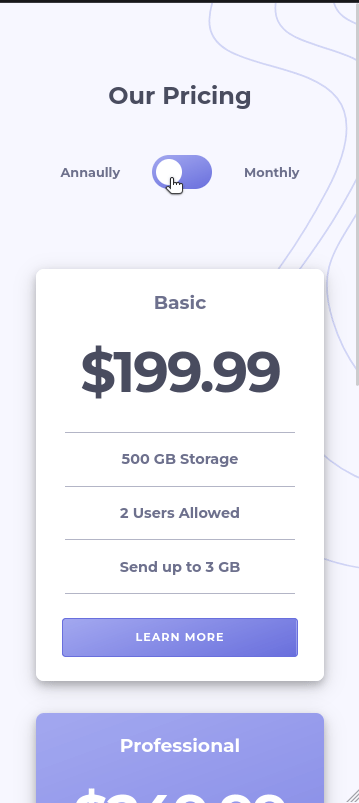

# Frontend Mentor - Pricing component with toggle solution

This is a solution to the [Pricing component with toggle challenge on Frontend Mentor](https://www.frontendmentor.io/challenges/pricing-component-with-toggle-8vPwRMIC). Frontend Mentor challenges help you improve your coding skills by building realistic projects. 

## Table of contents

- [Overview](#overview)
  - [The challenge](#the-challenge)
  - [Screenshot](#screenshot)
  - [Links](#links)
- [My process](#my-process)
  - [Built with](#built-with)
  - [What I learned](#what-i-learned)
  - [Continued development](#continued-development)
  - [Useful resources](#useful-resources)
- [Author](#author)
- [Acknowledgments](#acknowledgments)

## Overview

### The challenge

Users should be able to:

- View the optimal layout for the component depending on their device's screen size
- Control the toggle with both their mouse/trackpad and their keyboard
- **Bonus**: Complete the challenge with just HTML and CSS

### Screenshot

### Links

- Solution URL: [Frontend Mentor Solution](https://www.frontendmentor.io/solutions/pricing-component-bulit-with-sass-and-bem-naming-practices-aIEVkPNCP)
- Live Site URL: [Github Pages](https://kmullen444.github.io/pricing-compenen-with-toggle/)

## My process

### Built with

- Semantic HTML5 markup
- CSS custom properties
- Flexbox
- Mobile-first workflow
- [Sass](https://sass-lang.com/) - Css preprocessor language for CSS
- [BEM](https://en.bem.info/methodology/quick-start/) - Name convention for HTML elements

### Useful resources

- [How TO - Toggle switch](https://www.w3schools.com/howto/howto_css_switch.asp) - Create a toggle switch with CSS.

## Author

- Website - [Kevin Mullen](kevinmullen.net)
- Frontend Mentor - [@Kmullen444](https://www.frontendmentor.io/profile/Kmullen444)
